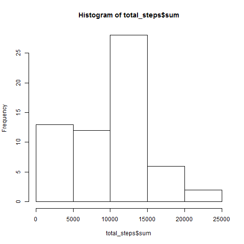
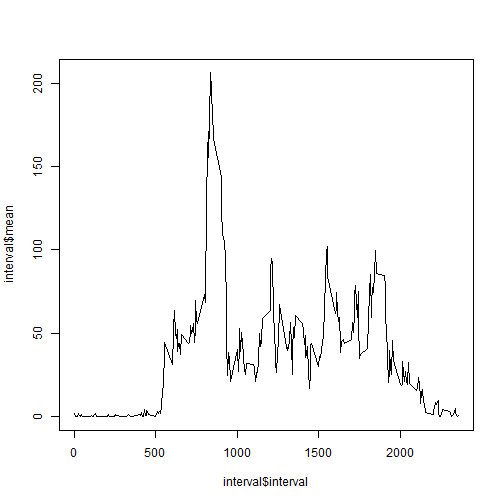
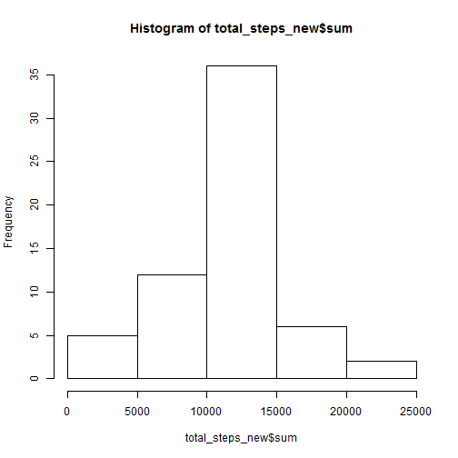

```r
echo = TRUE #always make code visible
```


```r
#Loading and preprocessing the data
setwd("C:/Users/shanna_ricketts/SkyDrive/Documents/Coursera courses/Reproducible Research")
x<-read.csv("activity.csv")
options(repos = c(CRAN = "http://cran.rstudio.com"))
install.packages("dplyr")
```

```
## Installing package into 'C:/Users/shanna_ricketts/Documents/R/win-library/3.0'
## (as 'lib' is unspecified)
```

```
## 
##   There is a binary version available (and will be installed) but
##   the source version is later:
##       binary source
## dplyr    0.2  0.4.1
## 
## package 'dplyr' successfully unpacked and MD5 sums checked
## 
## The downloaded binary packages are in
## 	C:\Users\shanna_ricketts\AppData\Local\Temp\RtmpCa2S1L\downloaded_packages
```

```r
library("dplyr")
```

```
## Warning: package 'dplyr' was built under R version 3.0.3
```

```
## 
## Attaching package: 'dplyr'
## 
## The following objects are masked from 'package:stats':
## 
##     filter, lag
## 
## The following objects are masked from 'package:base':
## 
##     intersect, setdiff, setequal, union
```

```r
library("knitr")
```


#What is the mean total number of steps taken per day?
###Total number of steps taken per day

```r
total_steps <- x%>%group_by(date)%>%summarise(sum(steps, na.rm = TRUE))
```

### Histogram of the total number of steps taken each day

```r
hist(total_steps$sum)
```

 
###Mean of the total number of steps taken per day

```r
mean_steps <- mean(total_steps$sum)
mean_steps
```

```
## [1] 9354.23
```
###Median of the total number of steps taken per day

```r
median_steps <- median(total_steps$sum)
median_steps
```

```
## [1] 10395
```

#What is the average daily activity pattern?

```r
interval <- x%>%group_by(interval) %>% summarise(mean(steps, na.rm = TRUE))
```
###Time Series Plot

```r
plot(interval$interval, interval$mean, type = "l")
```

 
###5-minute interval that contains the maximum number of steps

```r
max_interval <- summarise(interval, max(interval$mean))
max_interval
```

```
## Source: local data frame [1 x 1]
## 
##   max(interval$mean)
## 1           206.1698
```
#Imputing missing values
###Total number of missing values in the dataset

```r
sum(is.na(x))
```

```
## [1] 2304
```
###Fill in missing values in the dataset

```r
m<-merge(x, interval, by = "interval")

for (i in 1:nrow(m)){
        if (is.na(m$steps[i])) {
              m$steps_new[i] <- m$mean[i]
      }
      else {
        m$steps_new[i]<-m$steps[i] 
      }
        }

#New dataset
head(m)
```

```
##   interval steps       date mean(steps, na.rm = TRUE) steps_new
## 1        0    NA 2012-10-01                  1.716981  1.716981
## 2        0     0 2012-11-23                  1.716981  0.000000
## 3        0     0 2012-10-28                  1.716981  0.000000
## 4        0     0 2012-11-06                  1.716981  0.000000
## 5        0     0 2012-11-24                  1.716981  0.000000
## 6        0     0 2012-11-15                  1.716981  0.000000
```

###Histogram of total number of steps taken each day

```r
total_steps_new <- m%>%group_by(date)%>%summarise(sum(steps_new))
hist(total_steps_new$sum)
```

 
### Mean total number of steps taken per day

```r
mean_steps_new <- mean(total_steps_new$sum)
mean_steps_new
```

```
## [1] 10766.19
```
### Median total number of steps taken per day

```r
median_steps_new <- median(total_steps_new$sum)
median_steps_new
```

```
## [1] 10766.19
```
##Do these values differ from the first part of the assignment?
###What is the impact of imputing missing data on the estimates of the total daily number of step?
These values differ. 

#Are there differences in activity patterns between weekdays and weekends?
